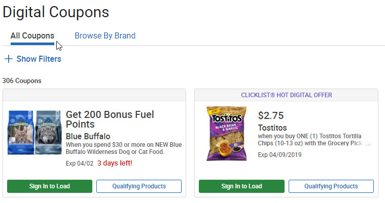
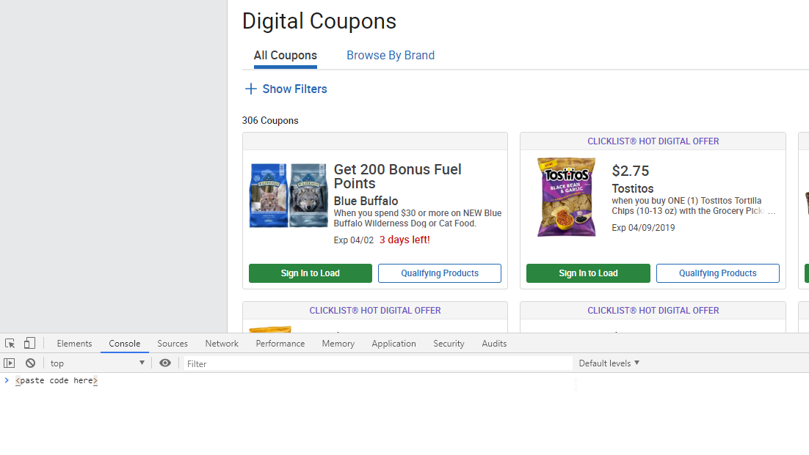

# Load all Kroger coupons to your card.

This is a script used to load all coupons onto your card, rather than click each coupon individually. Unfortunately, Kroger limits 150 coupons to your loyalty card. Therefore, to make the best use of this script, using the filters to filter out the items you would never use (ie. Tobacco) to reduce the amount of coupons being shown. This makes sure you load coupons most prevalent to your needs.

## Steps to use

1.) Navigate to Kroger coupons page
* Apply any filers

2.) Open your browser's console (F12 in Google Chrome) 
* Paste the code from any of the .js files in this repo.
* Press \<enter\> to run.
